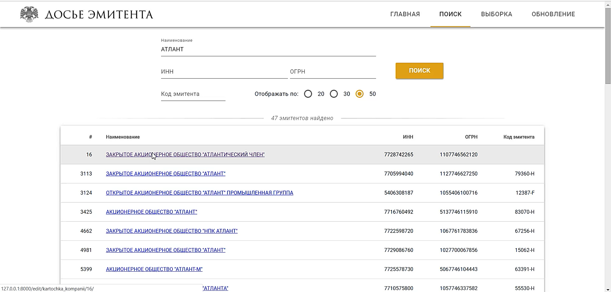
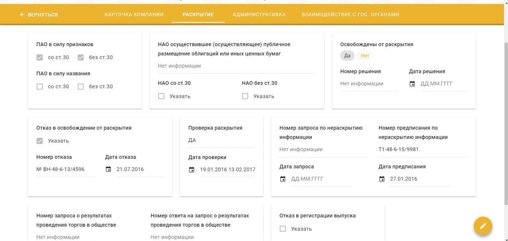
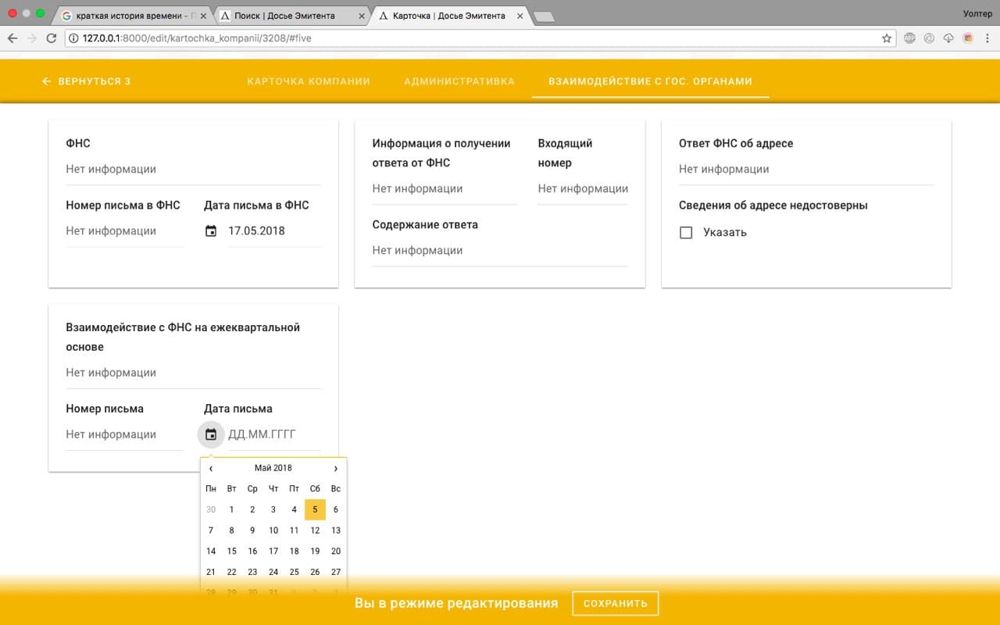
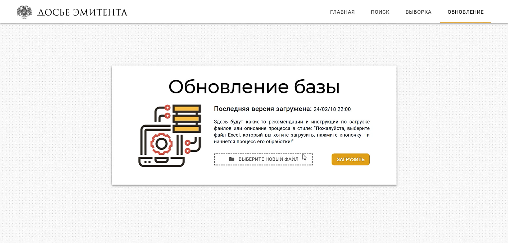

# Issuers Archive

This is an early version of a project which aim was to automate the workflow of part of the Corporate Affairs Department responsible for issuer's accounting, done in collaboration with @Platypus98 , @sleep3r and others.

## Installing and running

> Clone and enter the project directory

```bash
$ git clone https://github.com/apopelyshev/bank_project_v2
$ cd bank_project_v2
```

> Start virtualenv

```bash
$ python3 -m venv venv/
$ source venv/bin/activate
```

> Install the dependencies

```bash
$ pip install -r requirements.txt
```

> Launch the app

```bash
$ cd cb
$ python3 manage.py runserver
```

> View the app at: http://127.0.0.1:8000/index/

## UI demostration

_Home page - greeting, time, latest changes, login floating button_


_Search page - a table with issuers (with pagination size customization)_


_Issuer's card_


_Edit mode is enabled when editing_


_Database update page - displays the last successful attempt at updating the records_


_DB update progress animation_


